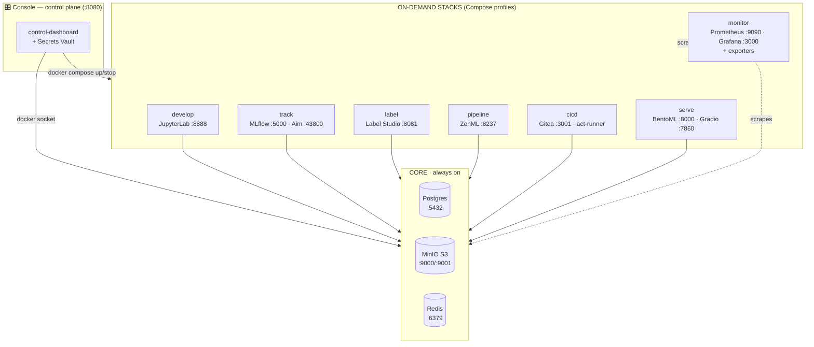

<div align="center">

# 🧠 OpenML

### SageMaker / Vertex‑at‑home — the full ML lifecycle on a single Mac

**A personal, local‑first MLOps platform that runs the entire ML pipeline — develop, label, track, orchestrate, CI/CD, and serve — on one Apple Silicon machine via Docker Compose, driven by a custom real‑time console.**

[-black?logo=apple)](docs/macos-constraints.md)
[](docker-compose.yml)
[](#-prerequisites)
[](#-roadmap)
[](#-monitoring--observability)
[](LICENSE)
[](#-contributing)

[Overview](#-overview) · [Getting Started](#-getting-started) · [Services & Ports](#-services--ports) · [Commands](#-command-reference) · [Architecture](#-architecture) · [Contributing](#-contributing)

</div>

---

## 📖 Overview

**OpenML** reproduces the useful parts of **AWS SageMaker AI** and **Google Vertex AI** on a single **Apple M4 / 24 GB** machine — no cloud bill, no account, no data leaving your laptop. Everything is defined in **one `docker-compose.yml`**, and a **custom console** ("the platform's control plane") lets you turn each stack on and off so you never blow past your RAM budget.

It's built for one person who wants the whole ML lifecycle in one place:

> **develop** in JupyterLab → **label** data in Label Studio → **version** it with DVC → **track** experiments in MLflow + Aim → **orchestrate** pipelines with ZenML → **train‑on‑push** with Gitea Actions → **serve** the model with BentoML → **watch** it all in Grafana.

Long‑term goal: polish this into the most efficient, robust, and approachable **self‑hosted MLOps toolkit** for AI/ML pipelining — the tool you reach for when you want SageMaker‑grade workflow ergonomics on your own hardware.

### Why OpenML?

| | |
|---|---|
| 🏠 **Local‑first** | Runs entirely on your machine. Your data and models never leave it. |
| 🎛️ **One console for everything** | A single pane at `localhost:8080` starts/stops stacks, shows live CPU/RAM, health, and a memory‑budget bar. |
| 🧩 **Modular by design** | Compose **profiles** group services into stacks — run only what you need to fit 24 GB of RAM. |
| 📦 **Everything‑in‑Compose** | No stray `docker run`/`docker build`. One file is the entire platform; reproducible and auditable. |
| 🔭 **Full observability** | Prometheus scrapes **25 targets**; Grafana visualizes training, host, containers, serving, and a whole‑platform overview. |
| 🔐 **Built‑in secrets vault** | Envelope‑encrypted (AES‑256‑GCM) secrets manager inside the console, with a stdlib CLI for other projects. |
| 🍏 **Apple‑Silicon‑native** | arm64 images; GPU‑heavy training runs natively on the host against the same endpoints. |

---

## 📑 Table of Contents

- [Overview](#-overview)
- [Architecture](#-architecture)
- [Prerequisites](#-prerequisites)
- [Getting Started](#-getting-started)
- [Services & Ports](#-services--ports)
- [The Console](#-the-console)
- [Stacks, Profiles & Memory Budget](#-stacks-profiles--memory-budget)
- [Monitoring & Observability](#-monitoring--observability)
- [Secrets Vault](#-secrets-vault)
- [Notebooks & Demos](#-notebooks--demos)
- [Command Reference](#-command-reference)
- [Apple Silicon — Two Hard Constraints](#-apple-silicon--two-hard-constraints)
- [Configuration](#-configuration)
- [Security](#-security)
- [Roadmap](#-roadmap)
- [Documentation](#-documentation)
- [Troubleshooting](#-troubleshooting)
- [Contributing](#-contributing)
- [License](#-license)
- [Acknowledgements](#-acknowledgements)

---

## 🏗 Architecture

**Core** services (Postgres, MinIO, Redis, and the console) are always on. Everything else is an on‑demand **stack** the console toggles. All services share one bridge network (`openml_net`) and address each other by name.



### Concept mapping (SageMaker / Vertex → OpenML)

| SageMaker / Vertex | OpenML component | Stack |
|---|---|---|
| Studio / Workbench notebooks | JupyterLab | `develop` |
| Ground Truth / Data Labeling | Label Studio | `label` |
| Feature / data versioning | DVC (MinIO remote) | in `develop` |
| Pipelines | ZenML | `pipeline` |
| Experiments / tracking | MLflow + Aim | `track` |
| Model Monitor / infra metrics | Prometheus + Grafana + exporters | `monitor` |
| Projects / CI‑CD | Gitea + Actions | `cicd` |
| Endpoints (real‑time inference) | BentoML (+ Gradio playground) | `serve` |
| Artifact store (S3) | MinIO | `core` |
| Metadata DB | Postgres | `core` |
| Message / frame bus | Redis | `core` |
| The AWS/GCP Console | **custom control‑dashboard** | `core` |

> Full details in [`docs/architecture.md`](docs/architecture.md).

---

## ✅ Prerequisites

### Hardware
- **Apple Silicon Mac** (M1/M2/M3/M4). Designed and verified on an **M4 / 24 GB**.
- **≥ 60 GB free disk** (images + MinIO/Postgres data grow over time).

### Software

| Requirement | Version | Notes |
|---|---|---|
| **[Docker Desktop for Mac](https://www.docker.com/products/docker-desktop/)** | latest | The only hard dependency. Provides the Docker Engine + Compose v2. |
| **git** | any | To clone the repo. |
| **make** | any (ships with macOS Xcode CLT) | Convenience targets. Optional — you can call `docker compose` directly. |
| **Python 3.10+** | host‑side | *Optional*, only for GPU‑heavy native training against the platform endpoints. |

### Recommended Docker Desktop settings
`Settings → Resources`:

| Setting | Value |
|---|---|
| **Memory** | **12–14 GB** (of 24 GB) |
| **CPUs** | 6–8 |
| **Swap** | 1–2 GB |
| **Disk** | ≥ 60 GB |

> Also enable *Settings → General → Start Docker Desktop when you sign in* so the platform returns automatically after a reboot. Data always survives in named volumes.

---

## 🚀 Getting Started

```bash
# 1. Clone
git clone https://github.com/SAGE-Rebirth/open-ml.git
cd open-ml

# 2. Start CORE (postgres, minio, redis, console) — builds images on first run.
#    The Makefile auto-creates .env from .env.example.
make up

# 3. Open the console
open http://localhost:8080
```

From the console, toggle **Develop · JupyterLab** on, then:

```bash
open http://localhost:8888          # token: openml   (see .env)
```

Run **`notebooks/00_minio_smoke_test.ipynb`** to confirm the container reaches MinIO, Postgres, Redis, and torch. That's it — flip on any other stack from the console when you need it.

> **First time?** The initial `make up` builds a few local images and can take a couple of minutes. Subsequent starts are seconds.

---

## 🌐 Services & Ports

All host ports bind to **`127.0.0.1`** by default (localhost‑only, no auth by design). Values live in `.env` (`.env.example` is the map). **Change every credential before exposing anything beyond your Mac.**

| Service | Stack | Host Port | URL | Default Login |
|---|---|---|---|---|
| **Console** (control‑dashboard) | `core` | `8080` | http://localhost:8080 | — |
| **JupyterLab** | `develop` | `8888` | http://localhost:8888 | token `openml` |
| **MinIO** — API | `core` | `9000` | http://localhost:9000 | `minioadmin` / `minioadmin123` |
| **MinIO** — Console | `core` | `9001` | http://localhost:9001 | `minioadmin` / `minioadmin123` |
| **Postgres** | `core` | `5432` | `localhost:5432` | `openml` / `openml` |
| **Redis** | `core` | `6379` | `localhost:6379` | — |
| **MLflow** | `track` | `5000` | http://localhost:5000 | — |
| **Aim** (UI / server) | `track` | `43800` / `53800` | http://localhost:43800 | — |
| **Grafana** | `monitor` | `3000` | http://localhost:3000 | `admin` / `admin` (+ anon viewer) |
| **Prometheus** | `monitor` | `9090` | http://localhost:9090 | — |
| **cAdvisor** | `monitor` | `8082` | http://localhost:8082 | — |
| **node‑exporter** | `monitor` | `9100` | http://localhost:9100 | — |
| **Pushgateway** | `monitor` | `9091` | http://localhost:9091 | — |
| **Label Studio** | `label` | `8081` | http://localhost:8081 | `admin@openml.local` / `openml-admin` |
| **ZenML** | `pipeline` | `8237` | http://localhost:8237 | `NO_AUTH` (localhost) |
| **Gitea** | `cicd` | `3001` | http://localhost:3001 | `openml` / `openml-admin` |
| **BentoML** inference | `serve` | `8000` | http://localhost:8000 | — |
| **Gradio** playground | `serve` | `7860` | http://localhost:7860 | — |

**Internal exporters** (on `openml_net`, not published to the host): `postgres-exporter :9187` · `redis-exporter :9121` · `blackbox-exporter :9115` — scraped by Prometheus.

---

## 🎛 The Console

The heart of OpenML is a purpose‑built **FastAPI + docker‑py + vanilla‑JS** console (`control-dashboard/`) — no framework, no CDN, one page.

- **Toggle stacks on/off** with a click; it runs `docker compose up -d --build` / `stop` under the hood.
- **Live health & resource view** — per‑container CPU/RAM, health status, restart counts, and a **memory‑budget bar** against your VM size.
- **Setup‑jobs strip** — one‑shot init jobs (`db-init`, `minio-init`, …) show as ✓ done.
- **Never blocks** — a single background poller refreshes a cached snapshot, so the UI and its SSE stream stay instant even if the docker socket is busy.
- **Hosts the Secrets Vault** (see below).
- **Hardened** — refuses to stop core infra or itself, escapes all user input, and guards against CSRF / DNS‑rebinding on state‑changing requests.

---

## 🧮 Stacks, Profiles & Memory Budget

On 24 GB you can't run everything at once. Services are grouped into **stacks** (Compose profiles); run only what you need.

| Stack (profile) | Services | ~Idle RAM |
|---|---|---|
| `core` *(always on)* | control‑dashboard, postgres, minio, redis | ~0.5 GB |
| `develop` | jupyter | ~0.4 GB |
| `track` | mlflow, aim | ~0.45 GB |
| `monitor` | prometheus, grafana, cadvisor, node‑exporter, pushgateway, postgres/redis/blackbox exporters | ~0.95 GB |
| `label` | label‑studio | ~0.6 GB |
| `pipeline` | zenml | ~0.4 GB |
| `cicd` | gitea, act‑runner | ~0.35 GB |
| `serve` | inference (BentoML) + playground (Gradio) | ~0.2 GB + model |
| `vision` ⏳ | frame‑consumer (+ host camera bridge) | ~0.05 GB |

A comfortable everyday set is **`core + develop + track + monitor` ≈ 2.3 GB idle**, leaving the rest of the VM for actual CPU training. Toggle stacks off in the console when done — `stop` frees the RAM while keeping the container for an instant restart.

> See [`docs/memory-and-profiles.md`](docs/memory-and-profiles.md) for recipes (labeling session, serving, etc.).

---

## 🔭 Monitoring & Observability

OpenML monitors **the whole platform**, not just training runs.

- **Prometheus scrapes 25 targets** — every core service, the monitor stack itself, and every app.
- **Native exporters:** MinIO (`/minio/v2/metrics/*`), Gitea, Grafana, plus sidecar **postgres‑exporter** and **redis‑exporter**.
- **Blackbox exporter** gives HTTP **up/down + latency** for every app with no native metrics (MLflow, Aim, ZenML, Jupyter, Label Studio, Gradio, Gitea, the console).
- **Pushgateway** receives live gauges from training/data jobs (batch‑only — populated *during* a run by the telemetry helper).

**Five provisioned Grafana dashboards** (`monitoring/grafana/dashboards/`):

| Dashboard | Shows |
|---|---|
| **Platform Overview** | Service up/down matrix, latencies, VM budget, Postgres/Redis/MinIO internals |
| **ML Training** | Live loss / accuracy / lr from the current run |
| **Host & Containers** | Per‑container CPU/mem, VM memory |
| **Data Prep** | Dataset rows, class balance, split sizes |
| **Serving** | BentoML request rate, latency, errors |

The one‑line telemetry helper (`notebooks/openml_telemetry.py`) fans metrics to **MLflow + Aim + Pushgateway** at once and cleans up on exit. See [`docs/reliability.md`](docs/reliability.md).

---

## 🔐 Secrets Vault

Built into the console (no extra container). **Envelope encryption** — one random Data Encryption Key (AES‑256‑GCM) per vault encrypts all secrets; the DEK is wrapped by multiple **key slots** so *any one* unlocks:

- **passphrase** (Argon2id‑hardened) · **access codes** (one per device) · **one‑time recovery key** · optional **auto‑unseal**

Create **multiple named vaults**; scope each secret **`global`** or to a **project name**. Storage is Postgres (ciphertext at rest); the DEK lives only in the console's memory while unlocked. Read from any project with the pure‑stdlib CLI:

```bash
ln -s "$(pwd)/cli/openml-secret" /usr/local/bin/openml-secret
openml-secret set OPENAI_API_KEY sk-... --vault work --scope webapp
openml-secret get OPENAI_API_KEY --vault work --scope webapp
```

> Full guide: [`docs/vault.md`](docs/vault.md).

---

## 📓 Notebooks & Demos

| Notebook | Phase | What it does |
|---|---|---|
| `00_minio_smoke_test.ipynb` | 0 | MinIO r/w, Postgres, Redis, torch (CPU) sanity check |
| `01_training_telemetry.ipynb` | 1 | torch training → live Grafana gauges + MLflow + Aim + model registry |
| `02_labeling_and_dvc.ipynb` | 2 | generate images → Label Studio → DVC push to MinIO |
| `03_pipeline.ipynb` | 3 | ZenML `ingest → preprocess → train → evaluate → register` |

Serving (Phase 5) has no notebook — `curl :8000/predict` or use the Gradio playground.

---

## 🛠 Command Reference

Always run `make` from the repo root (it exports `OPENML_PROJECT_DIR=$(pwd)`, which the console needs).

### Make targets

| Command | Description |
|---|---|
| `make up` | Start **core** (postgres, minio, redis, console) + build images |
| `make develop` | Start JupyterLab |
| `make ps` | Status of everything (all profiles) |
| `make logs S=jupyter` | Tail one service's logs |
| `make build` | Build local images (dashboard + jupyter) |
| `make stop` | Stop containers, keep data (frees RAM) |
| `make down` | Remove containers, keep volumes |
| `make config` | Validate & render the merged compose config |
| `make prune` | Reclaim disk (build cache, dangling images, unused volumes) |
| `make nuke` | **DANGER:** remove containers **and** volumes (wipes data) |
| `make help` | List all targets |

### Direct docker compose

The console starts a stack by naming its services (which activates the profile):

```bash
export OPENML_PROJECT_DIR=$(pwd)             # or just use `make`

# start a stack
docker compose up -d --build mlflow aim                    # track
docker compose up -d --build prometheus grafana cadvisor \
  node-exporter pushgateway postgres-exporter \
  redis-exporter blackbox-exporter                          # monitor

# stop a stack (keeps the container, frees RAM)
docker compose stop mlflow aim

# health sweep — want all `healthy`, 0 restarts
docker ps --filter label=openml.managed=true
```

---

## 🍏 Apple Silicon — Two Hard Constraints

Docker Desktop runs Linux in a VM. Two limits shape the whole design (details in [`docs/macos-constraints.md`](docs/macos-constraints.md)):

1. **No camera / USB passthrough into containers.** The Mac camera is bridged from the host (Phase 6), never `--device`'d in.
2. **No Apple GPU (MPS/Metal) inside containers.** GPU‑heavy training runs **natively on the host** against the same MLflow/MinIO endpoints; containers do orchestration, tracking, serving, and CPU work.

```bash
# native GPU training that logs into the platform:
export MLFLOW_TRACKING_URI=http://localhost:5000
export MLFLOW_S3_ENDPOINT_URL=http://localhost:9000
export AWS_ACCESS_KEY_ID=minioadmin AWS_SECRET_ACCESS_KEY=minioadmin123
python train.py            # torch.device("mps") — artifacts land in the platform
```

---

## ⚙️ Configuration

Everything (ports, credentials, bucket names, memory caps) lives in **`.env`**. `make` creates it from `.env.example` automatically; to customize:

```bash
cp .env.example .env        # then edit
```

Key knobs: `BIND_HOST` (default `127.0.0.1`), `*_PORT`, `*_MEM_LIMIT`, service credentials, `MINIO_BUCKETS`, and `OPENML_ALLOWED_HOSTS` (CSRF allowlist for the console).

---

## 🔒 Security

Designed for a **single personal machine**:

- **Localhost‑only** — host ports bind to `127.0.0.1` (`BIND_HOST`). Set `0.0.0.0` to expose on your LAN **only after adding auth and changing all default credentials**.
- **Console hardening** — refuses to stop core infra or itself, validates/allowlists every controllable service, escapes all user input (vault UI + `/metrics`), and blocks cross‑origin / DNS‑rebinding writes.
- **Docker socket** — the console mounts `/var/run/docker.sock` (effectively root on host); inherent to a container that starts/stops others. Keep its port on `127.0.0.1`.
- **Default credentials** in `.env` are for localhost only — **change them** for anything beyond your Mac.

> Run a security review of pending changes anytime with the bundled workflow (see [`docs/reliability.md`](docs/reliability.md)).

---

## 🗺 Roadmap

| Phase | Stack | Status |
|---|---|---|
| 0 | core + develop (console, Postgres, MinIO, Redis, JupyterLab) | ✅ |
| 1 | track + monitor (MLflow, Aim, Prometheus/Grafana + full exporters) | ✅ |
| 2 | label (Label Studio + DVC → MinIO) | ✅ |
| 3 | pipeline (ZenML, example pipeline) | ✅ |
| 4 | cicd (Gitea + Actions, train‑on‑push) | ✅ |
| 5 | serve (BentoML + Gradio, from MLflow registry) | ✅ |
| 6 | **vision** (host camera bridge → Redis + container consumer) | ⏳ **next** |

---

## 📚 Documentation

Per‑topic guides live in [`docs/`](docs/):

- [`architecture.md`](docs/architecture.md) — concept mapping, networking, build order
- [`macos-constraints.md`](docs/macos-constraints.md) — the two hard Apple‑Silicon limits
- [`memory-and-profiles.md`](docs/memory-and-profiles.md) — stack → profile → RAM map + recipes
- [`reliability.md`](docs/reliability.md) — failure modes, health, recovery cheatsheet
- [`labeling.md`](docs/labeling.md) · [`pipelines.md`](docs/pipelines.md) · [`cicd.md`](docs/cicd.md) · [`serving.md`](docs/serving.md) · [`vault.md`](docs/vault.md)

---

## 🩺 Troubleshooting

| Symptom | Fix |
|---|---|
| `docker ps` errors / socket missing | Docker Desktop quit (Mac sleep). `open -a Docker`, wait ~30–60 s. |
| Containers `Exited` after a Desktop restart | They don't auto‑start after a full quit. `make up`, then toggle stacks. |
| A service is `unhealthy` | `docker logs openml-<svc>` for the reason; `docker compose restart <svc>`. |
| Prometheus shows old config after editing `prometheus.yml` | Single‑file bind mounts need a recreate: `docker compose up -d --force-recreate prometheus`. |
| Pushgateway UI is empty | Expected — it's batch‑only, populated *during* a training run and cleared on exit. |
| Everything feels slow / OOM | Too many stacks on. Stop what you're not using; watch the console's memory bar. |
| Full reset | `make stop && make up` (keeps data) · `make nuke` (wipes data). |

---

## 🤝 Contributing

Contributions are **very welcome** — whether it's a bug fix, a new stack, docs, or a Grafana dashboard. OpenML aims to be the friendliest self‑hosted MLOps toolkit, and that only happens with community help.

### Ground rules (the "golden rules")

1. **Everything lives in `docker-compose.yml`.** No independent `docker build` / `docker run` / `docker volume create` — every image is a compose service with a `build:` context, every volume is declared in the compose `volumes:` block.
2. **Verify against the running system, SRE‑style.** Measure before changing, then prove the change end‑to‑end with real values. Every change should end with a health sweep (all `healthy`, 0 restarts, data intact).
3. **Localhost‑only.** Host ports bind to `127.0.0.1` via `${BIND_HOST}`. Never expose a port without adding auth + changing default creds.
4. **Memory limits on every container** (`mem_limit`) so a runaway kills only itself.
5. **Keep docs in sync.** Finish a feature → update the README, the relevant `docs/*.md`, and the roadmap.

### Adding a service

Give it a `profiles:` entry, the three labels (`openml.managed/stack/service`), `restart: unless-stopped` (one‑shots use `restart: "no"`), a healthcheck, a `mem_limit`, `${BIND_HOST}:` on any published port, and a named volume for any path the image declares `VOLUME` on. Then register it in `control-dashboard/app/stacks.py` and add its port to `.env.example`.

### Development workflow

```bash
git checkout -b feat/my-change
# ... make changes ...
make config                     # validate the compose file
docker compose up -d --build <service>   # bring it up
docker ps --filter label=openml.managed=true   # health sweep
```

- **Rebuild the console** after editing `control-dashboard/app/*.py` or `static/index.html`:
  `docker compose up -d --build control-dashboard`.
- Open a **Pull Request** with a clear description and the verification output (health sweep, metrics query, etc.). Small, focused PRs merge fastest.
- Found a bug or have an idea? **[Open an issue](https://github.com/SAGE-Rebirth/open-ml/issues).**

### Good first contributions

- New Grafana dashboards or panels
- Additional example notebooks / demos
- Phase 6 (the host camera bridge)
- Alternative serving runtimes (MLServer, Seldon) as ZenML deployer components
- Docs, typo fixes, and troubleshooting entries

> Please be respectful and constructive — this is a welcoming project. Per Apache‑2.0 §5, contributions you submit are licensed under the project's [Apache License 2.0](LICENSE) unless you state otherwise.

---

## 📄 License

Released under the **[Apache License 2.0](LICENSE)** — free to use, modify, and distribute, with an explicit patent grant and trademark protection. See the [`LICENSE`](LICENSE) file for the full text.

---

## 🙏 Acknowledgements

OpenML stands on the shoulders of excellent open‑source projects:
[Docker](https://www.docker.com/) · [MinIO](https://min.io/) · [PostgreSQL](https://www.postgresql.org/) · [Redis](https://redis.io/) · [JupyterLab](https://jupyter.org/) · [MLflow](https://mlflow.org/) · [Aim](https://aimstack.io/) · [Prometheus](https://prometheus.io/) · [Grafana](https://grafana.com/) · [Label Studio](https://labelstud.io/) · [DVC](https://dvc.org/) · [ZenML](https://zenml.io/) · [Gitea](https://gitea.io/) · [BentoML](https://bentoml.com/) · [Gradio](https://gradio.app/) · [FastAPI](https://fastapi.tiangolo.com/).

<div align="center">

**Built with ❤️ for the local‑first ML community.**

If OpenML helps you, consider giving it a ⭐ on [GitHub](https://github.com/SAGE-Rebirth/open-ml).

</div>
